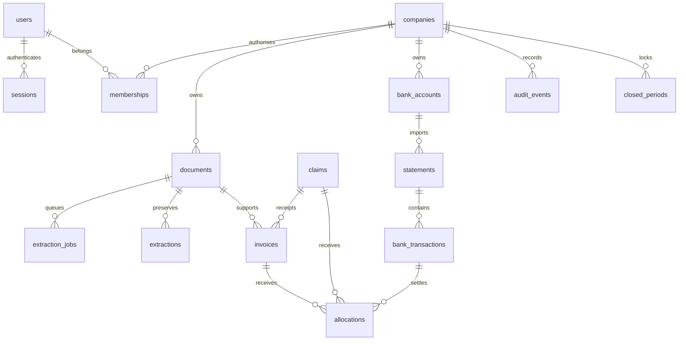

# Database architecture

The operational schema is relational, company-scoped and uses PostgreSQL UUID primary keys. Money is BIGINT in minor units (limited to JS safe integers at service boundaries), confidence is 0–100, date-only values use DATE, timestamps use TIMESTAMPTZ. JSONB is used for immutable provider payloads and audit diffs, not as a replacement for financial relationships.

## Stage 1–5 tables

| Table | Purpose / principal invariants |
|---|---|
| users | Normalised unique email, password hash, name; no plaintext credentials |
| companies | Name, base currency, timezone; transaction locking anchor |
| memberships | Unique company/user; role and department; current membership checked on every request |
| sessions | SHA-256 token hash, user, expiry; raw token only in secure cookie |
| auth_attempts | Persistent rate-limit key/window/count |
| documents | Company, uploader, immutable storage key, SHA-256, MIME, size, batch, purpose, claim, perceptual hash; original filename is metadata only |
| extraction_jobs | Document, state, attempts, lease expiry, last error; one active logical extraction per original |
| extractions | Append-only original provider result, provider/model, confidence, document, creation time |
| invoices | Document/page provenance, optional claim, type, party, invoice/due dates, number, description, product/service, payment terms, bank reference, subtotal/tax/total, currency, suggested/reviewed category, confidence, review/lifecycle, duplicate evidence, version, approver |
| claims | Employee, department, period, claimed total, currency, review state, manager and finance approvals, exception reason |
| bank_accounts | Company, label, currency |
| statements | Account/month, original document, opening/closing, review state, parsed draft payload |
| bank_transactions | Statement, row index, date, description, bank reference, in/out direction, amount, running balance, fingerprint, bank-only category |
| allocations | Bank transaction to exactly one invoice OR claim; positive amount; creator, timestamp; append-only |
| audit_events | Actor, company, entity, action, before/after JSONB, reason, timestamp; append-only database trigger |
| closed_periods | Company/month unique, closed by/at; guard financial mutations even before closing UI exists |
| reconciliation_decisions | Persistent rejected bank/target pairs; independent of the visible audit-history limit |
| invoice_cancellations | Append-only cancellation of an unpaid approved invoice; original values/approval retained |

Tenant-bearing relationships use composite company/id foreign keys. Index company plus date/review state and parent references. Fingerprints flag suspected duplicates instead of automatically deleting legitimate repeated charges. A source hash alone does not prove a duplicate financial obligation when one PDF contains several invoices.

## Derived data

Paid amount = sum(confirmed allocations). Outstanding = approved total − paid. Overdue = positive outstanding and due date before as-of date. Claims use the same settlement rule after Finance approval. Allocation capacity is checked under a transaction lock against both sides. Draft and rejected invoices never enter financial totals. Receipt rows attached to claims are supporting evidence, excluded from standalone Money Out/Transactions recognition.

## Planned schema extensions (not silently removed)

Stages 6–10: financial snapshots with formula version and as-of time; budget versions/lines/approvals; close checklist/exceptions/amendments; report snapshots/citations; chat conversations/tool traces. Phase 2: recurrence rules, revenue contracts, forecast runs/assumptions, scenarios, products/clients/projects/departments/cost centres, anomaly observations, recommendation approvals, notification outbox. Phase 3: integrations/sync cursors, payment intents, accounting mappings, journal entries/lines, balances, assets and tax configuration. Founder advances require separate liabilities and repayment allocations (planned Stage 6 extension, before founder-paid expense support is enabled).

## Migration and recovery

Checked-in SQL migrations plus Drizzle schema are authoritative. Use `npm run db:migrate` against the configured database; local preview initializes the same migrations only in local mode. Deploy migrations once before starting production replicas. Back up PostgreSQL and original objects together; verify restoration and audit continuity before production. Never use schema push or destructive resets on production.
