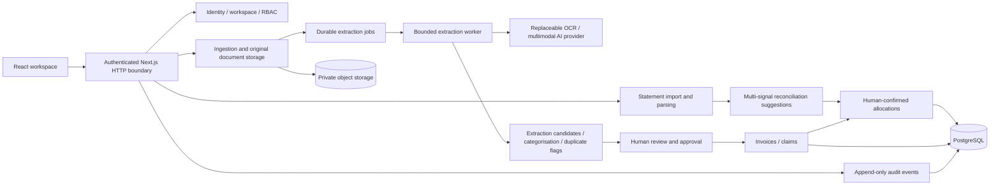

# AI Finance & Budgeting System — architecture

Design baseline: all 60 sections of the supplied specification, read before implementation. Delivery in this increment: build-order Stages 1–5, not all of MVP Phase 1. Nothing in Stages 6–10 or Phases 2–3 is discarded.

## Runtime and boundaries

Next.js App Router / React / TypeScript supplies the web UI and authenticated HTTP boundary. A modular monolith keeps financial mutations in server services, independent of UI. Drizzle ORM targets PostgreSQL. Production uses a PostgreSQL connection pool; an explicitly local, single-process PGlite PostgreSQL runtime lets this Windows workspace run without Docker or a database installation. It is not the production database topology. Deploy the Node server and worker alongside managed PostgreSQL and private S3-compatible object storage.

## Modules and contracts

- Identity: scrypt password hashes, opaque hashed database sessions, expiry, HttpOnly / SameSite cookies, origin checks for mutations, persistent login throttling. Active company must be backed by membership. No client-supplied role is trusted.
- Ingestion: maximum 200 documents per batch, 20 MB per file, allowed formats verified by content. Store immutable originals before extraction; preserve source hashes and ownership. Browser uploads in bounded requests with per-file results. Retry failed jobs without creating duplicate financial records.
- Extraction: provider-neutral structured result with raw response, model, field values, confidence, page ranges and errors. Configurable live multimodal provider; unconfigured provider returns missing values and Needs Review. Never fabricate invoice content. Exact known demo fixtures may use clearly marked fixture extraction. Multi-document PDFs produce candidates with source-page provenance; original PDF remains intact.
- Categorisation: suggestions only; confidence below 80% enters Needs Review. Approval always requires a human, regardless of confidence. User corrections and reasons are retained alongside original results.
- Invoices: sales and supplier records are recognised only after approval. Lifecycle (Draft / Issued / Cancelled) is separate from computed settlement (Unpaid / Partial / Paid / Overdue). Invoice values never move cash.
- Claims: employees see only their own claims/documents; managers see assigned departments; Finance/Admin review company claims. Submitted amount and receipt total stay separate. Flag missing evidence, exact duplicates, business-key and image similarity candidates. Manager then Finance approval. Exceptions require an explicit recorded reason. Payout is represented by confirmed bank allocations; no claim is marked Paid merely by approval.
- Bank parsing: CSV and XLSX structured adapters and PDF extraction provider. Import drafts are reviewed before committing transactions. Account currency, statement month, opening/closing balances and row provenance are retained. Ambiguous rows block import. Deduplicate re-imports by source and stable row fingerprint; suspicious repeated transactions require review, not silent dropping.
- Reconciliation: amount, direction, currency, name, reference, invoice number and date generate explainable candidates. Historical patterns are an additional signal when available. Amount alone never produces an automatic match. Human confirmations insert many-to-many allocations transactionally; total allocations cannot exceed either bank amount or approved obligation. Lock company row to serialize competing mutations. Split/combine is the same allocation primitive. Bank-only categorisation is explicit and audited.
- Reporting, budgeting, calculations and AI analysis are independent future modules. Stage 1–5 home shows operational counts, not an unimplemented financial dashboard. No made-up financial insights.

## Security and consistency

All reads are company-scoped, including downloads and audit retrieval. Mutations re-check current membership and authorisation inside server code; tenant foreign-key constraints guard cross-company links. Audit writes and financial changes share a transaction. Company-level transaction locking initially trades throughput for safe settlement invariants; replace with deterministic per-record locking after profiling. Approved records cannot be edited in place; future corrections use versioned amendments / reversals. Closed-period table and guards exist now; the closing workflow is Stage 8. Period checks include recognition dates and bank dates. Preserve originals, AI responses, corrections, approvals and allocation history; never hard-delete finance records.

Amounts are integer minor units, parsed from decimal strings without floating-point arithmetic. Currency is explicit; unsupported scale/currency is rejected and cross-currency settlement requires a later explicit FX policy. Dates use ISO date-only strings; company timezone defaults to Asia/Kuala_Lumpur. No currency aggregation without conversion. Claims are expenses once approved and must not double-count receipt invoices. Company cash is derived only from bank activity in Stage 6; opening balances are independently evidenced.

## Operations and production gate

Database migrations are explicit, versioned and checked in. Production startup must not create sample users or auto-migrate. Object credentials and AI keys remain server-only. Local storage lives outside public/. S3 deployment uses encryption, private buckets, restricted IAM, retention/backups and short-lived access. Jobs have attempts, errors, leases and recovery; local preview can drain jobs inline, production runs a dedicated poller. PostgreSQL backups/PITR, object recovery drills, monitoring, malware scanning/quarantine, independent security review, email verification/reset/MFA and load testing remain release gates; this implementation is not represented as certified production-ready.

## Decisions / open policies

Default base currency MYR; allow currencies with two fractional digits initially and explicitly reject unsupported currencies rather than silently rounding. No FX conversions, tax advice, payroll, statutory accounts or payment initiation in this increment. No external notifications are sent. Self-approval of employee/manager claims is blocked; Admin may approve with a recorded override reason. Accountant is read/export-only. New member assignment requires an existing registered user and Admin authorisation; public signup does not grant access to an existing company.

References consulted for implementation: [Next.js installation](https://nextjs.org/docs/app/getting-started/installation), [Drizzle PostgreSQL drivers](https://orm.drizzle.team/docs/connect-overview), [Drizzle PGlite](https://orm.drizzle.team/docs/connect-pglite), [PGlite persistence](https://pglite.dev/docs/).
